# songSearch

## Premise

In this project, you will build a React web application. You will use your knowledge of React components, passing state, and requests with the Spotify API to build a website that allows users to search the Spotify library, create a custom playlist, then save it to their Spotify account.

## Version 2

Please read the synopsis for Version 1 (below)

The major changes between version 1 and version 2 occur within the realms of design and code readability. 

**Regarding readability:**
- **Reactstrap** was used primarily in the App componenet to provide easier to read layout JSX.
- In version 1, class components were used. In version 2, all class components were transformed into **functional components** inorder to use **React hooks**.
- The components that existed in version 1, were broken down into more simplifed components inorder to better reuse components, and prevent unncessary code.
- A more definitive design pattern was used when **differntiating containers from presentational components**. In version 2, containers are components that handle logic, such as setting state. 
- **propTypes** were introduced to provide prop validation and simplify prop documentation. 

**Regarding design:**
- The flow of the app was visually simplifed with the hope of limiting user confusion. 
- Upon app load, the only elements that the user is presented with are the logo, search bar, and the current log of public playlists created by the user. 

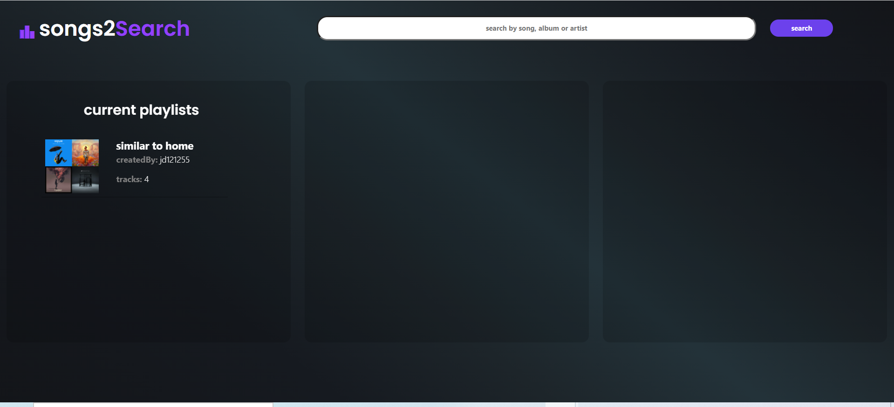

- The flow of the app remains the same. The user searches, and the search results appear in the center of the app screen. The design difference is that unlike version 1, the search results and the build playlist sections will only appear to the user when the user needs them (after searching, and after adding a track to the to-be-created playlist). This decision was made with the hope that the app is more intuitive, less confusing and thus more usuable.

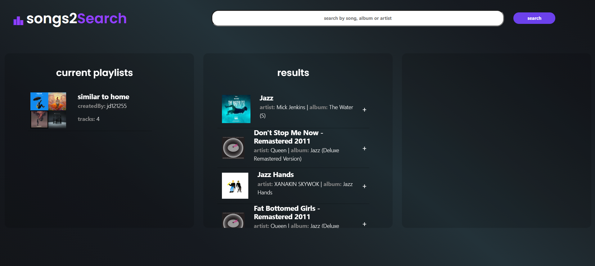

The playlist builder only appears after the user has added a song to the to-be-created playlist. The track information will appear in the far right section. An alert will also appear at the bottom of the screen. The alert appears in green to visually indicate "addition".

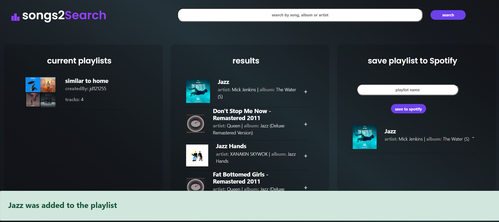

If the user chooses to remove a song from the playlist, an alert will appear in red. The alert appears in red to visually indicate "removal".

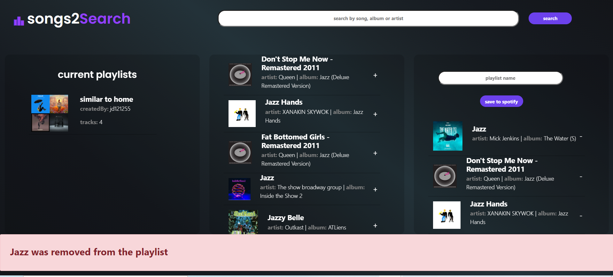

The visual alert pattern continues. When the user saves the playlist, the app visually returns to the familiar ultra simplifed presentation of only the logo, search bar, and playlist log. The user will briefly see a blue alert, that indicates that the playlist was successfully added to the Spotify account. Different from version 1, the current playlist log updates automatically. The user will be able to see the newly created playlist appear in the log, after a successful POST request is completed. The user does not have to refresh the app. 

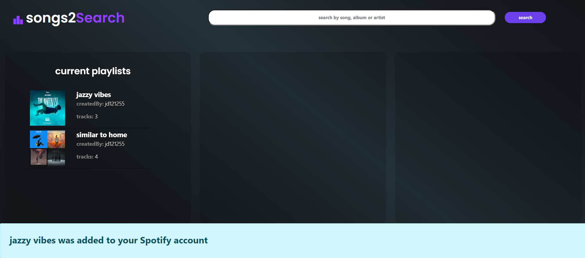

As in version 1, once saved, the user has saved the playlist to their account. They can return to the device that holds their Spotify app and enjoy the playlist.

## Version 1

Upon accessing the website, the user is met with the Spotify authorization page. The user logs in to their Spotify account and provides the app permission to access and post to the account

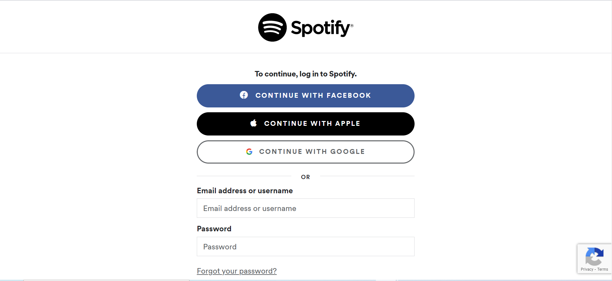

Upon providing permission, the user will be redirected to the app home. They are presented with 3 columns. The column farthest to the left presents to the user a list of playlist that they have already created. The second column (middle) provides the user with the ability to search via artists, albums or track names via the Spotify API. And lastly, the third column is used to construct basic playlists. 

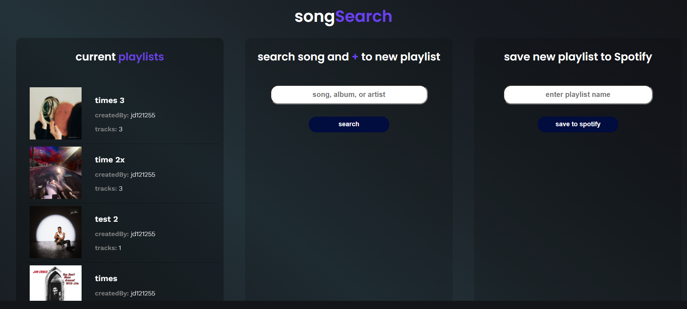

After the user searches, 20 of the most relevant matches are displayed. The user can scroll and read the basic descriptions for each match. The user can click on the plus icon (+) to add the track to the third column (playlist builder).

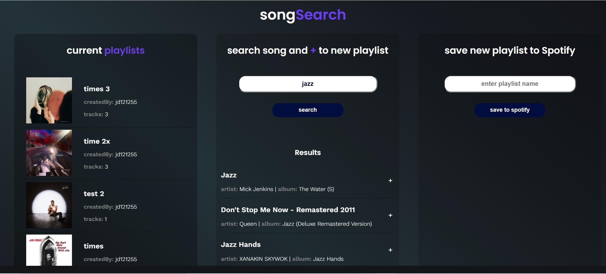

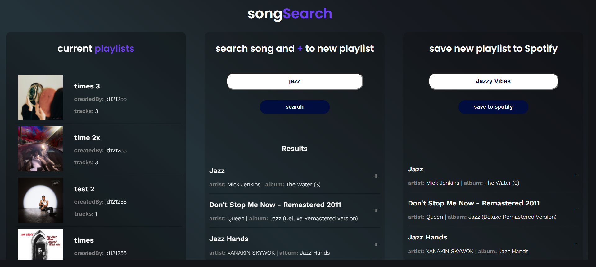

Once the tracks are added to the playlist builder, the user can either remove the added tracks from the playlist or once satisified save the playlist to their Spotify account. 

Once saved, the user has saved the playlist to their account, they can return to the device that holds their Spotify app and enjoy the playlist.

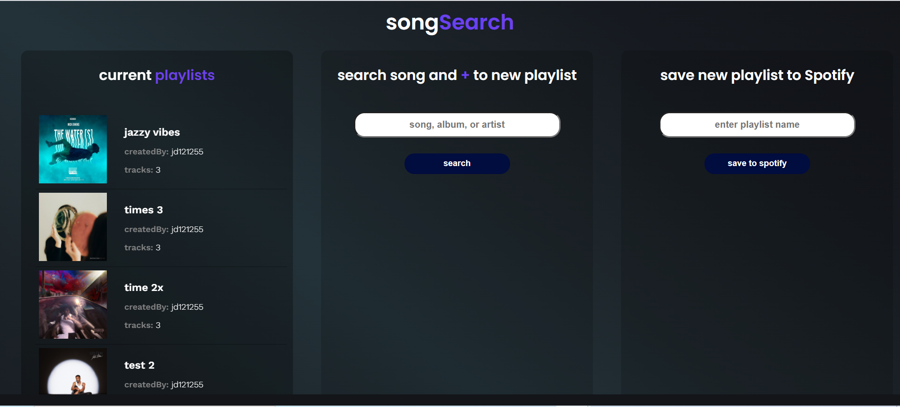

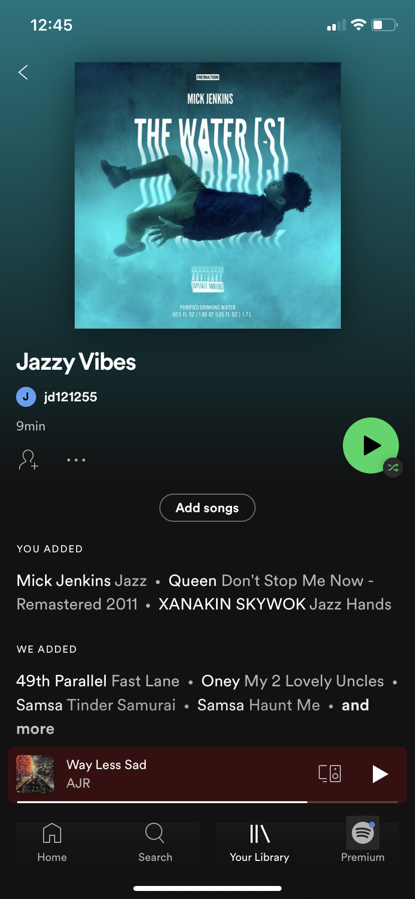
